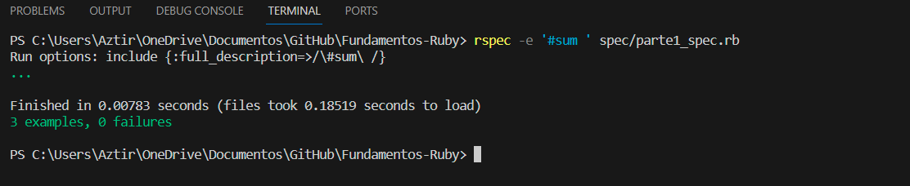

# Fundamentos-Ruby

# **Parte 1: Arreglos, hashes y enumerables**

## **Método 1: `sum(array)`**

Primero, definimos el método **`sum(array)`** en el archivo **`lib/ruby_intro.rb`**. Este método toma un arreglo de números enteros como argumento y devuelve la suma de sus elementos. Si el arreglo está vacío, el método debe devolver cero. Aquí está mi código:

```ruby
def sum(array)
array.reduce(0, :+)
end
```

Luego, ejecutamos las pruebas asociadas a este método usando el siguiente comando en la terminal:

```ruby
rspec -e '#sum' spec/parte1_spec.rb
```

Obteniendo una salida como la siguiente: 




Este resultado significa que todas las pruebas asociadas con el método **`sum`** se ejecutaron con éxito y no se detectaron errores. Además, el método **`sum`** se comporta según lo esperado, proporcionando la suma correcta de elementos en el arreglo de entrada.

## **Método 2: `max_2_sum(array)`**

A continuación, definimos el método **`max_2_sum(array)`** en el mismo archivo **`lib/ruby_intro.rb`**. Este método toma un arreglo de números enteros como argumento y devuelve la suma de los dos elementos más grandes. Si el arreglo está vacío, el método debe devolver cero. Aquí está mi código:

```ruby
def max_2_sum(array)
sorted_array = array.sort.reverse
sum_of_max_2 = sorted_array.take(2).sum
end
```

Luego, ejecutamos las pruebas asociadas a este método usando el siguiente comando en la terminal: 

```ruby
rspec -e '#max_2_sum' spec/parte1_spec.rb
```

Obteniendo una salida como la siguiente: 


El resultado de las pruebas nos dice que todas las pruebas asociadas con el método `max_2_sum` se ejecutaron exitosamente, sin detectar errores. Esto demuestra que el método `max_2_sum` está funcionando según lo esperado, proporcionando la suma correcta de los dos elementos más grandes en el arreglo de entrada, incluso en casos especiales como cuando los dos valores más grandes son iguales.

## **Método 3: `sum_to_n?(array, n)`**

Finalmente, definimos el método **`sum_to_n?(array, n)`** en el mismo archivo **`lib/ruby_intro.rb`**. Este método toma un arreglo de números enteros y un número entero adicional **`n`** como argumentos. El método verifica si hay dos elementos en el arreglo cuya suma sea igual a **`n`**. Utilicé el método **`combination`** para generar todas las combinaciones posibles de dos elementos y verifiqué si alguna de ellas sumaba a **`n`**. Aquí está mi código:

```ruby
def sum_to_n?(array, n)
array.combination(2).any? { |a, b| a + b == n }
end
```

Después, ejecuté las pruebas asociadas a este método usando el siguiente comando en la terminal:

```ruby
rspec -e '#sum_to_n' spec/parte1_spec.rb
```

De este modo se obtuvo la siguiente salida:


 En este caso, las pruebas relacionadas con el método **`sum_to_n?(array, n)`** se ejecutaron exitosamente y no se detectaron errores. Esto demuestra que el método **`sum_to_n?(array, n)`** está funcionando de según los esperando, verificando con precisión si existen dos elementos cuya suma sea igual a **`n.`**

# **Parte 2: Cadenas y expresiones regulares**

# **Método 1: `hello(name)`**

Comenzamos definiendo el método **`hello`** en el archivo **`lib/ruby_intro.rb`**. Este método toma un argumento **`name`** y devuelve una cadena de saludo que incluye el nombre proporcionado.

```ruby
def hello(name)
"Hello, #{name}"
end
```

Luego, ejecutamos las pruebas relacionadas con el método **`hello`** utilizando el comando **`rspec -e '#hello' spec/parte2_spec.rb`**. 

```ruby
rspec -e '#hello' spec/parte2_spec.rb
```

 Las pruebas verificaron si el método **`hello`** generaba la cadena de saludo esperada.


Después de la ejecución de las pruebas, obtuvimos la siguiente salida que mostraba que todas las pruebas asociadas con el método **`hello`** se ejecutaron exitosamente. Esto confirmó que el método **`hello`** funciona como se esperaba, devolviendo la cadena de saludo correcta.

# **Método 2: `starts_with_consonant?(s)`**

Luego, definimos el método **`starts_with_consonant?`** en el archivo **`lib/ruby_intro.rb`**. Este método toma una cadena **`s`** como argumento y utiliza una expresión regular para verificar si la cadena comienza con una consonante.

 

```ruby
def starts_with_consonant?(s)
	if s =~ /^[b-df-hj-np-tv-z]/i
		return true
	else
		return false
	end
end
```

Continuamos ejecutando las pruebas relacionadas con el método **`starts_with_consonant?`** con el comando **`rspec -e '#starts_with_consonant?' spec/parte2_spec.rb`**. Estas pruebas se encargaron de comprobar si el método identificaba correctamente si una cadena empezaba con una consonante.

```ruby
rspec -e '#starts_with_consonant?' spec/parte2_spec.rb
```

Después de ejecutar las pruebas, se observa que todas las pruebas relacionadas con el método **`starts_with_consonant?`** se ejecutaron con éxito. Esto confirmó que el método está funcionando como se esperaba.


# ****Método 3: `binary_multiple_of_4?(s)`**

Luego, definimos el método **`binary_multiple_of_4?`** en el archivo **`lib/ruby_intro.rb`**. Este método toma una cadena **`s`** y verifica si es un número binario válido y si es múltiplo de 4.

```ruby
def binary_multiple_of_4?(s)
		if s.match(/^[01]+$/)
		# Convierte la cadena a un número entero en base 2 y verifica si es múltiplo de 4
		binary_number = s.to_i(2)
		return binary_number % 4 == 0
	else
		return false
	end
end
```

Seguimos ejecutando las pruebas relacionadas con el método **`binary_multiple_of_4?`** utilizando el comando **`rspec -e '#binary_multiple_of_4?' spec/parte2_spec.rb`**. Estas pruebas evaluaron si el método identificaba correctamente si una cadena era un número binario múltiplo de 4.

```ruby
rspec -e '#binary_multiple_of_4?' spec/parte2_spec.rb
```

Después de las pruebas, observamos que todas se ejecutaron exitosamente. Esto demostró que el método **`binary_multiple_of_4?`** está implementado correctamente y funciona según lo esperado.


Se pudo  comprobar el progreso en todo lo anterior ejecutando:


# **Parte 3: Conceptos básicos de orientación a objetos**

Definimos una clase `BookInStock`en el archivo **`lib/ruby_intro.rb`**, que representa un libro con un número ISBN, isbn y el precio del libro como número de punto flotante, precio, como atributos.

```ruby
class BookInStock
  def initialize(isbn, price)
    validate_input(isbn, price)
    set_isbn(isbn)
    set_price(price)
  end

  def isbn
    @isbn
  end

  def isbn=(new_isbn)
    set_isbn(new_isbn)
  end

  def price
    @price
  end

  def price=(new_price)
    set_price(new_price)
  end

  def price_as_string
    "$%.2f" % @price
  end

  private

  def validate_input(isbn, price)
    if isbn.empty? || price <= 0
      raise ArgumentError, "ISBN no puede ser una cadena vacía y el precio debe ser mayor que cero"
    end
  end

  def set_isbn(new_isbn)
    @isbn = new_isbn
  end

  def set_price(new_price)
    @price = new_price
  end
end
```

Se ejecuto las pruebas asociadas usando los siguientes comandos

```ruby
rspec -e 'getters y setters' spec/parte3_spec.rb
rspec -e 'constructor' spec/parte3_spec.rb
rspec -e '#price_as_string' spec/parte3_spec.rb
```

Al ejecutar el comando **`rspec -e 'getters y setters' spec/parte3_spec.rb`**, todas las pruebas relacionadas con "getters y setters" en el archivo **`parte3_spec.rb`** se ejecutaron exitosamente.


Al ejecutar el comando **`rspec -e 'constructor' spec/parte3_spec.rb`**, todas las pruebas relacionadas con "constructor" en el archivo **`parte3_spec.rb`** se ejecutaron exitosamente.


Del mismo modo al ejecutar el comando **`rspec -e 'price_as_string.rb`**, todas las pruebas relacionadas con "price_as_string" en el archivo **`parte3_spec.rb`** se ejecutaron exitosamente.


# **Algo de TDD**

Para llevar a cabo este enfoque, configuramos un framework que nos permite ejecutar pruebas automáticas. En nuestro caso, utilizamos el framework "Guard" para gestionar y automatizar las pruebas.

Una vez que creamos nuestro archivo **`Guardfile`** y lo configuramos correctamente, iniciamos el proceso de pruebas automáticas ejecutando el siguiente comando en la terminal:

```ruby
bundle exec guard
```

Siguiendo la filosofía del TDD, comenzamos escribiendo nuestras pruebas antes de definir los métodos mencionados en las partes anteriores de esta actividad.

### **Para la parte 1**

En el archivo  **`parte1_spec.rb`** , como los métodos ****`sum(array)`,`max_2_sum(array)` ,`sum_to_n?(array, n)`** no han sido definidos, todas las pruebas fallan puesto que no hay con qué comparar y, por lo tanto, las pruebas no pueden validar el comportamiento de estos métodos, lo cual es precisamente lo que esperamos. Esto se ilustra a continuación:


Luego, procedemos a implementar el primer método, **`sum(array)`**. Una vez que completamos la implementación de este método, observamos que las pruebas relacionadas con **`sum(array)`** ya no fallan, lo que indica que este método pasa todas las pruebas diseñadas para el. Sin embargo, es importante destacar que que estas pruebas solo son satisfactorias para el método **`sum(array)`** y no necesariamente a los otros métodos mencionados, como **`max_2_sum(array)`** y **`sum_to_n?(array, n)`**, que aún no han sido implementados.


De manera similar, seguimos el mismo proceso para   **`max_2_sum(array)`** . En este punto, notamos que hay menos fallos, ya que las pruebas han pasado satisfactoriamente tanto para el primer método como para el segundo.


---

Finalmente, una vez que hemos implementado el último método y todas las pruebas han sido completadas con éxito.


### **Para la parte 2**

En la Parte 2, seguiremos un proceso similar, pero aplicando este enfoque a otros métodos y archivo diferente.

En el archivo  **`parte2_spec.rb`** , como los métodos ****`hello(name)`,`starts_with_consonant?(s)` ,`binary_multiple_of_4?(s)`** no han sido definidos, todas las pruebas fallan puesto que no hay con qué comparar y, por lo tanto, las pruebas no pueden validar el comportamiento de estos métodos, lo cual es precisamente lo que esperamos. Esto se ilustra a continuación:


Luego, procedemos a implementar el primer método, ****`hello(name)`****. Una vez que completamos la implementación de este método, observamos que las pruebas relacionadas con este método ya no fallan, lo que indica que este método pasa todas las pruebas diseñadas para el. Sin embargo, es importante destacar que que estas pruebas solo son satisfactorias para el y no necesariamente a los otros métodos mencionados.


Finalmente, una vez que hemos implementado el último método y todas las pruebas han sido completadas con éxito.

método 3:


### **Para la parte 3**

En el archivo **`parte3_spec.rb`**, como la clase **`BookInStock`** junto con sus métodos como **`getters`**, **`setters`**, y **`price_as_string`** no han sido definidos ni implementados en nuestro código, todas las pruebas fallan debido a la ausencia de una clase y métodos con los que puedan interactuar. En consecuencia, las pruebas no pueden validar el comportamiento de estos, lo cual es exactamente lo que esperamos. Esto se ilustra a continuación:


Una vez que hemos implementado la clase **`BookInStock`** con todos sus métodos correspondientes y hemos asegurado que estén correctamente definidos e implementados, observamos que las pruebas ahora pasan satisfactoriamente


De esta manera hemos aplicado con éxito la metodología del Desarrollo Guiado por Pruebas (TDD) en las tres etapas de nuestra actividad. Este enfoque nos ha permitido escribir pruebas antes de crear el código, lo que asegura la integridad del software y facilita la detección temprana de errores.